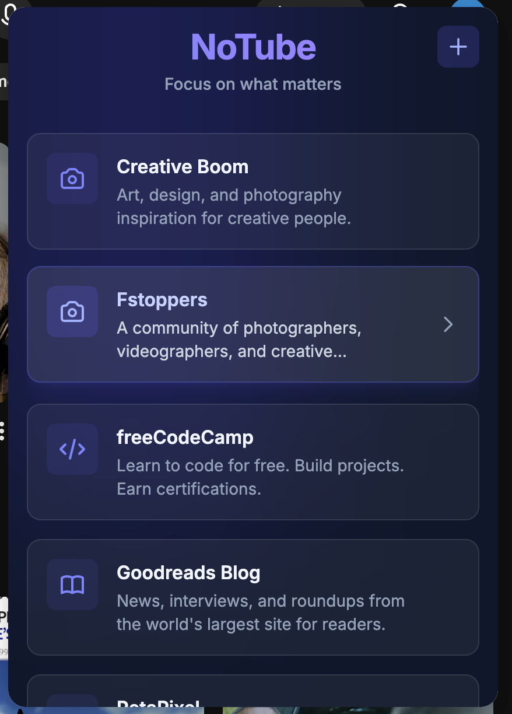
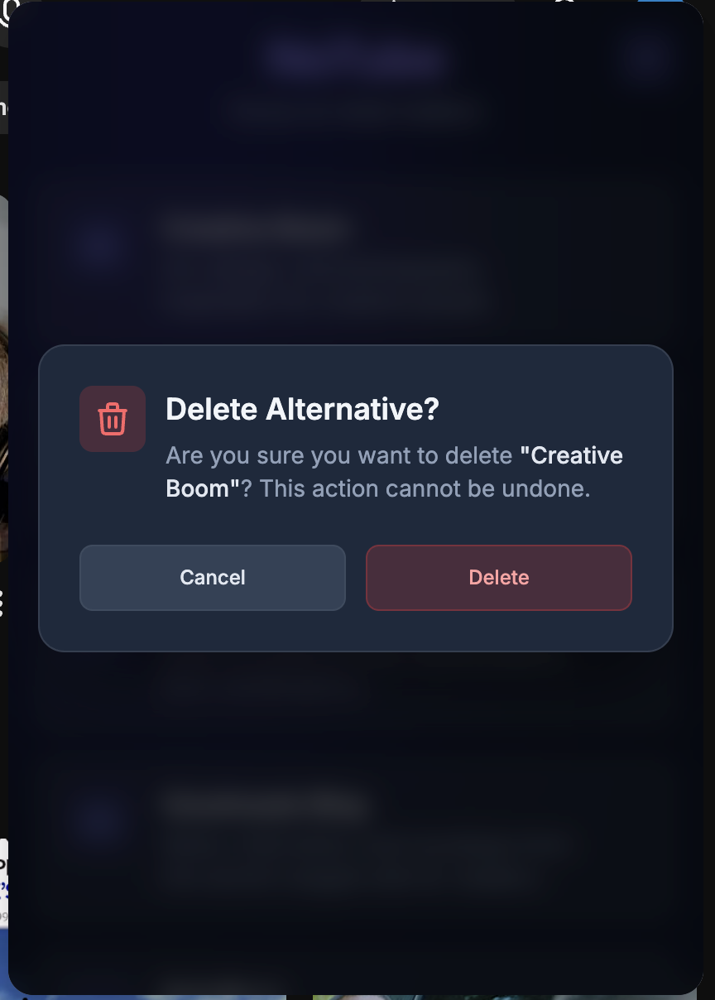

# 🚫 NoTube

> **Break your habits** — A Chrome extension that offers the chance to break the automatic Youtube opening and try something else..


---

## 📖 Overview

**NoTube** is a Chrome extension designed to help you reclaim your time and attention. When you visit YouTube, NoTube automatically presents you with a curated list of productive and enriching alternatives — from photography blogs to coding resources to book recommendations.

Instead of falling into the endless scroll, you'll be gently redirected toward content that aligns with your goals and interests.

---

## 📸 Screenshots


*The NoTube popup showing curated alternatives to YouTube*


*Long-press any alternative to remove it from your list*

---

## ✨ Features

### 🎯 **Auto-Popup on YouTube**
- Automatically displays when you visit YouTube.com
- Elegant, non-intrusive overlay that appears in the top-right corner
- Reminds you to choose a more productive alternative

### 📚 **Curated Alternatives**
Pre-loaded with high-quality resources across multiple categories:
- **📷 Photography** — PetaPixel, DIY Photography, Strobist, Fstoppers, and more
- **📖 Books & Literature** — Book Riot, Literary Hub, The Millions, Goodreads Blog
- **💻 Software Development** — Coding Horror, Hacker Noon, freeCodeCamp, Stack Overflow Blog, Smashing Magazine

### ➕ **Add Custom Sites**
- Click the **+** button to add the current website to your personal list
- **AI-powered descriptions** — Automatically generates engaging descriptions using Groq AI
- Custom sites are stored locally and persist across sessions
- Newly added sites appear at the top of your list

### 🗑️ **Long-Press Deletion**
- Long-press (or click and hold) any alternative card to delete it

### 🔀 **Randomized Display**
- Alternatives are shuffled on each load to keep things fresh

### 🎛️ **Manual Toggle**
- Click the extension icon in your toolbar to toggle the popup on any page
- Close the popup by clicking outside of it or using the "Close Extension" button

---

## 🚀 Installation

### **From Source (Developer Mode)**

1. **Clone or download this repository**
   ```bash
   git clone https://github.com/yourusername/notube.git
   cd notube
   ```

2. **Configure API Key (Optional)**
   - To enable AI-generated descriptions for custom sites, you'll need a Groq API key
   - Get a free API key from [Groq Console](https://console.groq.com/)
   - Create a file at `config/local.json` with the following content:
   ```json
   {
     "groqApiKey": "your-api-key-here"
   }
   ```
   - This file is gitignored and will remain local to your machine

3. **Build the React app**
   ```bash
   cd app
   npm install
   npm run build
   cd ..
   ```

4. **Load the extension in Chrome**
   - Open Chrome and navigate to `chrome://extensions/`
   - Enable **Developer mode** (toggle in top-right corner)
   - Click **Load unpacked**
   - Select the `/notube` directory (the root folder containing `manifest.json`)

5. **Pin the extension** (optional)
   - Click the puzzle icon in Chrome's toolbar
   - Find **NoTube** and click the pin icon

---

## 🛠️ Tech Stack

### **Frontend**
- **React** — Modern UI library for building the popup interface
- **Vite** — Fast build tool and dev server
- **Tailwind CSS** — Utility-first CSS framework for styling
- **Groq AI** — Generates engaging descriptions for user-added sites

### **Extension Architecture**
- **Manifest V3** — Latest Chrome extension platform
- **Content Scripts** — Inject the popup iframe into web pages
- **Background Service Worker** — Handle extension icon clicks
- **Chrome Storage API** — Persist user-added alternatives

### **Project Structure**

The project is organized into two main parts:

#### **Root Directory** — Chrome Extension Files
These files **must** remain in the root because Chrome expects them there:
```
notube/
├── manifest.json          # Extension configuration (required by Chrome)
├── background.js          # Service worker for extension icon clicks
├── content.js             # Content script that injects the popup iframe
├── images/                # Extension icons (referenced by manifest.json)
│   ├── icon16.png
│   ├── icon48.png
│   └── icon128.png
└── config/                # Configuration files
```

#### **App Directory** — React Build Project
This is a **complete Vite/React project** that builds the popup UI:
```
app/
├── package.json           # Node dependencies for React app
├── vite.config.js         # Vite build configuration
├── tailwind.config.js     # Tailwind CSS configuration
├── src/                   # React source files
│   ├── App.jsx            # Main React component
│   ├── main.jsx           # React entry point
│   ├── groqApi.js         # AI description generation service
│   └── index.css          # Tailwind styles
├── public/                # Static assets
│   └── alternatives.json  # Curated alternatives data
├── dist/                  # Built output (referenced by manifest.json)
└── node_modules/          # Dependencies (generated)
```

**Why this separation?**
- Chrome extension files (manifest, scripts, icons) must be in the root
- The React app is a separate build project that compiles to `app/dist/`
- `content.js` loads the built React app from `app/dist/index.html` into an iframe
- This keeps the extension logic separate from the UI framework's build system

---

## 📝 How It Works

1. **Content Script Injection**
   - When you visit any webpage, `content.js` is loaded
   - On YouTube, it automatically creates an iframe popup after 1 second

2. **React App Display**
   - The iframe loads the built React app from `app/dist/index.html`
   - The app fetches alternatives from `alternatives.json`
   - User-added sites are loaded from Chrome's local storage

3. **Randomization & Display**
   - All alternatives (curated + custom) are combined and shuffled
   - Displayed in a beautiful card-based layout
   - Each card is clickable and opens in a new tab

4. **User Interaction**
   - Click outside the popup to dismiss it
   - Click the extension icon to toggle it on any page
   - Click the **+** button to add the current site to your list
     - AI automatically generates an engaging description using Groq
     - The new site appears at the top of your list
   - Long-press any card to delete it from your alternatives

---

### **Development Workflow**

```bash
# Install dependencies
cd app
npm install

# Run dev server (for testing UI changes)
npm run dev

# Build for production
npm run build


# Reload extension in Chrome after changes
# Go to chrome://extensions/ and click the reload icon
```

### **Updating Shared Library**

If you need to update the `@rooshi/notube-shared` dependency to the latest version:

```bash
cd app
npm update @rooshi/notube-shared
```

---

## 🔮 Potential Features

### **🎯 Smart Blocking**
- [ ] Customizable blocklist (add any distracting websites)
- [ ] Time-based blocking (e.g., block during work hours)
- [ ] Whitelist specific YouTube channels for educational content

### **📊 Analytics & Insights**
- [ ] See which alternatives you visit most
- [ ] Weekly/monthly productivity reports

### **🧠 Smart Recommendations**
- [ ] AI-powered alternative suggestions based on browsing history
- [ ] Category preferences and personalization
- [ ] Trending alternatives from the community
- [ ] Context-aware suggestions (e.g., coding resources during work hours)

### **🎨 Customization**
- [ ] Multiple theme options (light mode, custom colors)
- [ ] Adjustable popup size and position
- [ ] Custom motivational quotes or reminders
- [ ] Import/export alternative lists

### **📱 Cross-Platform**
- [ ] Firefox extension support
- [ ] Safari extension support
- [ ] Mobile browser support
- [ ] Sync alternatives across devices

### **🎓 Educational Mode**
- [ ] Whitelist educational YouTube channels
- [ ] Separate lists for work vs. leisure
- [ ] Study timer integration
- [ ] Pomodoro technique support

### **🔍 Search & Filter**
- [ ] Search through alternatives
- [ ] Filter by category
- [ ] Sort by recently added, most visited, etc.
- [ ] Tag system for better organization

### **💾 Data Management**
- [ ] Backup and restore settings
- [ ] Export alternatives as JSON/CSV
- [ ] Import alternatives from other productivity tools
- [ ] Cloud sync (optional)

---


## 🙏 Acknowledgments

- thanks gemini/claude ur the goat
